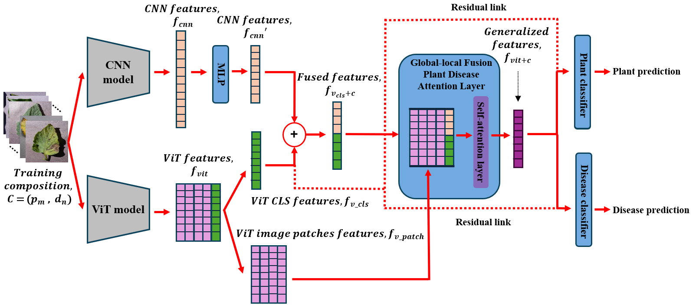
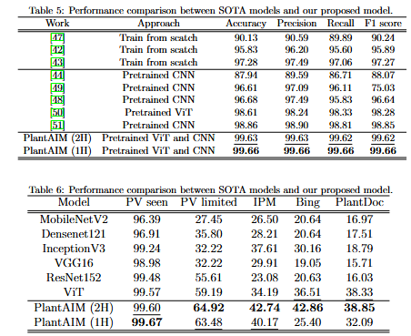
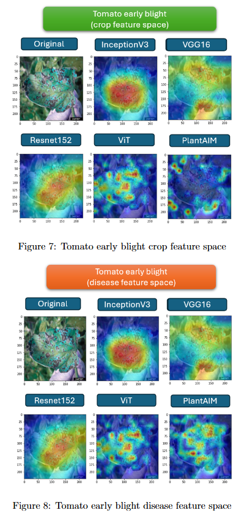
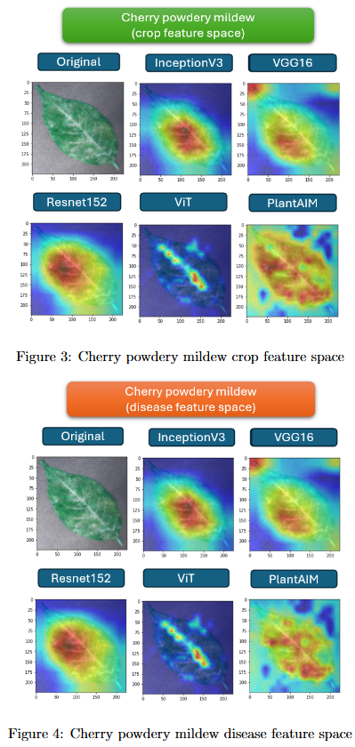
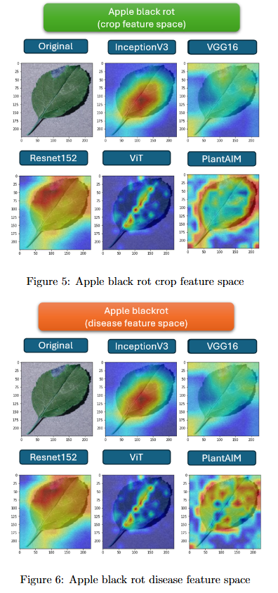

# PlantAIM: A New Baseline Model Integrating Global Attention and Local Features for Enhanced Plant Disease Identification


<p align="center">Proposed PlantAIM architecture.</p>

The contributions of this paper:
1. We introduce novel Plant Disease Global-Local Features Fusion Attention model (PlantAIM), which combines ViT and CNN components to enhance feature extraction for multi-crop plant disease identification.
2. Our experimental results demonstrate PlantAIM's exceptional robustness and generalization, achieving state-of-the-art performance in both controlled environments and real-world scenarios.
3. Our feature visualization analysis reveals that CNNs emphasize plant patterns, while ViTs focus on disease symptoms. By leveraging these characteristics, PlantAIM sets a new benchmark in multi-crop plant disease identification.

## Acc Result


## Grad-CAM visualization result




## Preparation
* PV Dataset: [spMohanty Github](https://github.com/spMohanty/PlantVillage-Dataset/tree/master)  
(You can group all images into single folder to directly use the csv file provided in this repo)
* PlantDoc dataset: [Kaggle](https://www.kaggle.com/datasets/abdulhasibuddin/plant-doc-dataset) 

* IPM and Bing dataset will be release soon

* download [ViT pretrained weight](https://github.com/rwightman/pytorch-image-models/releases/download/v0.1-vitjx/jx_vit_base_p16_224-80ecf9dd.pth) link (From [rwightman Github timm repo](https://github.com/huggingface/pytorch-image-models))

## Implementations
PlantAIM (2H) >> [code](model/PlantAIM_2H.py)

PlantAIM (1H) >> [code](model/PlantAIM_1H.py)

Notes
* The csv file (metadata of images) are [here](dataset/) 

## See also
1. [Pairwise Feature Learning for Unseen Plant Disease Recognition](https://ieeexplore.ieee.org/abstract/document/10222401/): The first implementation of FF-ViT model with moving weighted sum. The current work improved and evaluated the performance of FF-ViT model on larger-scale dataset.
2. [Unveiling Robust Feature Spaces: Image vs. Embedding-Oriented Approaches for Plant Disease Identification](https://ieeexplore.ieee.org/abstract/document/10317550/): The analysis between image or embedding feature space for plant disease identifications.
3. [Beyond-supervision-Harnessing-self-supervised-learning-in-unseen-plant-disease-recognition](https://www.sciencedirect.com/science/article/pii/S0925231224013791): Cross Learning Vision Transformer (CL-ViT) model that incorporating self-supervised learning into a supervised model.

## License

Creative Commons Attribution-Noncommercial-NoDerivative Works 4.0 International License (“the [CC BY-NC-ND License](https://creativecommons.org/licenses/by-nc-nd/4.0/)”)

## Citation

```bibtex
@article{chai2025plantaim,
  title={PlantAIM: A New Baseline Model Integrating Global Attention and Local Features for Enhanced Plant Disease Identification},
  author={Chai, Abel Yu Hao and Lee, Sue Han and Tay, Fei Siang and Go{\"e}au, Herv{\'e} and Bonnet, Pierre and Joly, Alexis},
  journal={Smart Agricultural Technology},
  pages={100813},
  year={2025},
  publisher={Elsevier}
}
