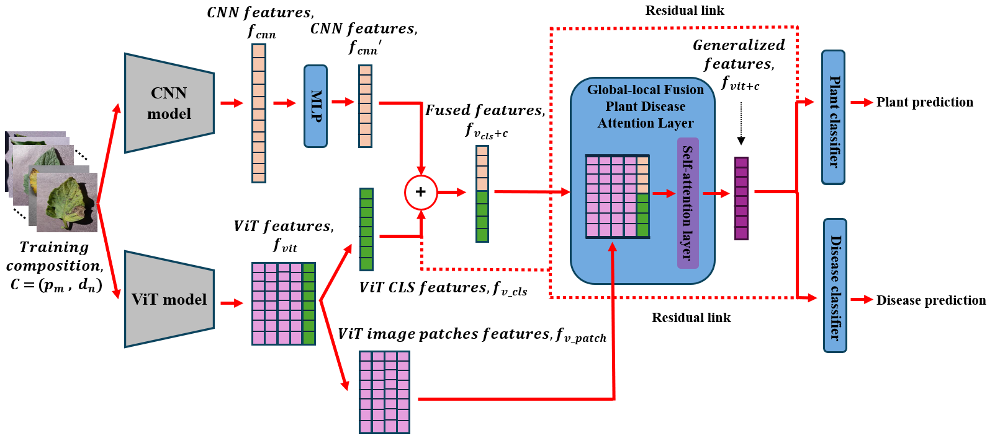
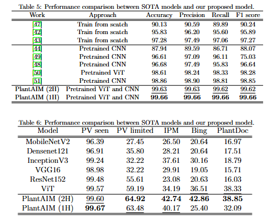
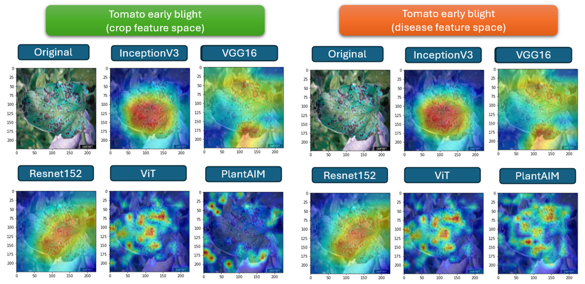
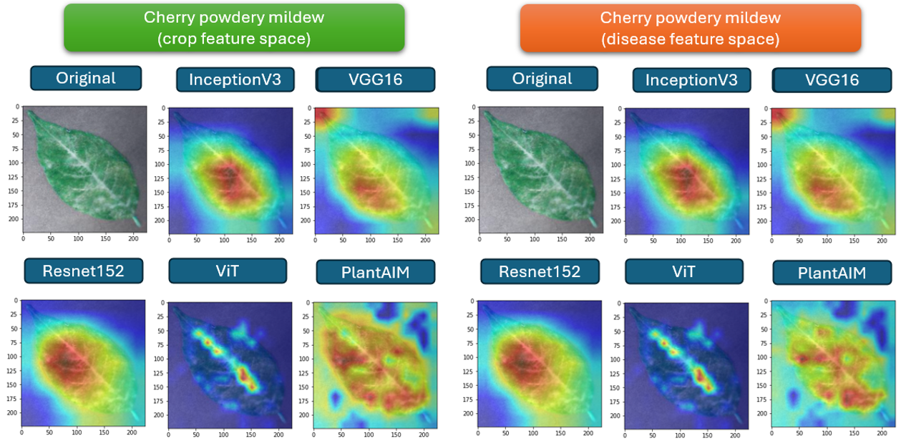
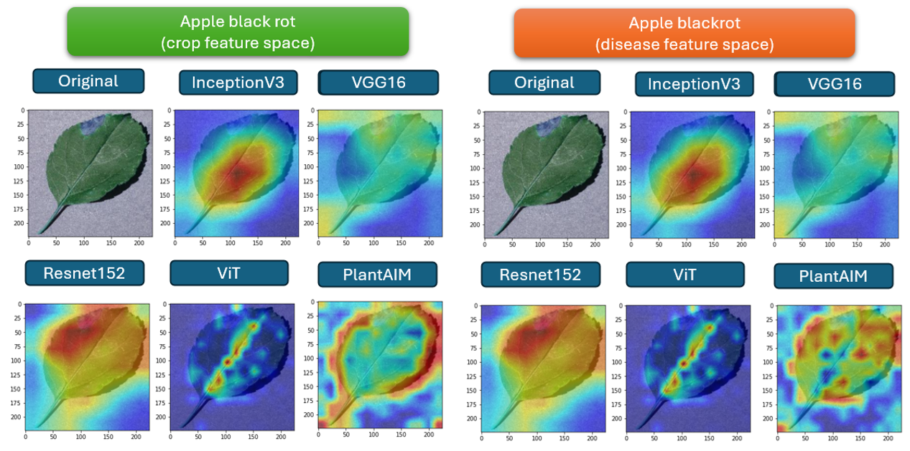

## Table of Contents
- [Abstract](#abstract)
- [Contribution](#contribution)
- [Proposed Model](#proposed-model)
- [Results](#result)
- [Preparation](#dataset-and-pretrained-weight)
- [Implementation](#implementations)
- [License](#license)
- [Citation](#citation)

# PlantAIM: A New Baseline Model Integrating Global Attention and Local Features for Enhanced Plant Disease Identification

## Abstract
[[Paper]](https://www.sciencedirect.com/science/article/pii/S2772375525000474)

Plant diseases significantly affect the quality and yield of agricultural production. Conventionally, detection has relied on plant pathologists, but recent advances in deep learning, particularly the Vision Transformer (ViT) and Convolutional Neural Network (CNN), have made it feasible for automated plant disease identification. Despite their prominence, there are still significant gaps in our understanding of how these models differ in feature extraction and representation, particularly in complex multi-crop disease identification tasks. This challenge arises from the simultaneous need to learn crop-specific and disease-specific features for accurate identification of crop species and its associated diseases. To address this, we introduce Plant Disease Glocal-Local Features Fusion Attention Model (PlantAIM), a new hybrid framework that fuses global attention mechanisms of ViT with local feature extraction capabilities of CNN. PlantAIM aims to improve the model's ability to simultaneously learn and focus on crop-specific and disease-specific features. We conduct extensive evaluations to assess the robustness and generalizability of PlantAIM compared to state-of-the-art (SOTA) models, including scenarios with limited training samples and real-world environmental data. Our results show that PlantAIM achieves superior performance. This research not only deepens our understanding of feature learning for ViT and CNN models, but also sets a new benchmark in the dynamic field of plant disease identification. The code will be made available upon publication.

## Contribution
1. We introduce novel Plant Disease Global-Local Features Fusion Attention model (PlantAIM), which combines ViT and CNN components to enhance feature extraction for multi-crop plant disease identification.
2. Our experimental results demonstrate PlantAIM's exceptional robustness and generalization, achieving state-of-the-art performance in both controlled environments and real-world scenarios.
3. Our feature visualization analysis reveals that CNNs emphasize plant patterns, while ViTs focus on disease symptoms.

## Proposed model
Plant Disease Global-Local Features Fusion Attention model (PlantAIM) [[code]](model/)
  * Key feature: combines ViT and CNN components to enhance feature extraction for multi-crop plant disease identification.

<p align="center">
  
  <br>
  <i>Proposed PlantAIM architecture.</i>
</p>

## Result


## Grad-CAM visualization result




## Dataset and pretrained weight
* PV Dataset: [spMohanty Github](https://github.com/spMohanty/PlantVillage-Dataset/tree/master)  
(You can group all images into single folder to directly use the csv file provided in this repo)
* PlantDoc dataset: [Kaggle](https://www.kaggle.com/datasets/abdulhasibuddin/plant-doc-dataset) 

* IPM and Bing dataset will be release soon

* download [ViT pretrained weight](https://github.com/rwightman/pytorch-image-models/releases/download/v0.1-vitjx/jx_vit_base_p16_224-80ecf9dd.pth) link (From [rwightman Github timm repo](https://github.com/huggingface/pytorch-image-models))

## Implementations
PlantAIM (2H) >> [pytorch implementation code](model/PlantAIM_2H.py)

PlantAIM (1H) >> [pytorch implementation code](model/PlantAIM_1H.py)

Notes
* The csv file (metadata of images) are [here](dataset/) 

## Virtual environment dependencies
Python 3.12.9
```
python -m venv py
cd .\py\Scripts
activate
pip install torch==2.6.0 torchvision==0.21.0 torchaudio==2.6.0 --index-url https://download.pytorch.org/whl/cu126
pip install -r requirements_plantaim.txt
```

## License

Creative Commons Attribution-Noncommercial-NoDerivative Works 4.0 International License (“the [CC BY-NC-ND License](https://creativecommons.org/licenses/by-nc-nd/4.0/)”)

## See also
1. [Pairwise Feature Learning for Unseen Plant Disease Recognition](https://ieeexplore.ieee.org/abstract/document/10222401/): The first implementation of FF-ViT model with moving weighted sum. The current work improved and evaluated the performance of FF-ViT model on larger-scale dataset.
2. [Unveiling Robust Feature Spaces: Image vs. Embedding-Oriented Approaches for Plant Disease Identification](https://ieeexplore.ieee.org/abstract/document/10317550/): The analysis between image or embedding feature space for plant disease identifications.
3. [Beyond-supervision-Harnessing-self-supervised-learning-in-unseen-plant-disease-recognition](https://www.sciencedirect.com/science/article/pii/S0925231224013791): Cross Learning Vision Transformer (CL-ViT) model that incorporating self-supervised learning into a supervised model.

## Citation

```bibtex
@article{chai2025plantaim,
  title={PlantAIM: A New Baseline Model Integrating Global Attention and Local Features for Enhanced Plant Disease Identification},
  author={Chai, Abel Yu Hao and Lee, Sue Han and Tay, Fei Siang and Go{\"e}au, Herv{\'e} and Bonnet, Pierre and Joly, Alexis},
  journal={Smart Agricultural Technology},
  pages={100813},
  year={2025},
  publisher={Elsevier}
}
